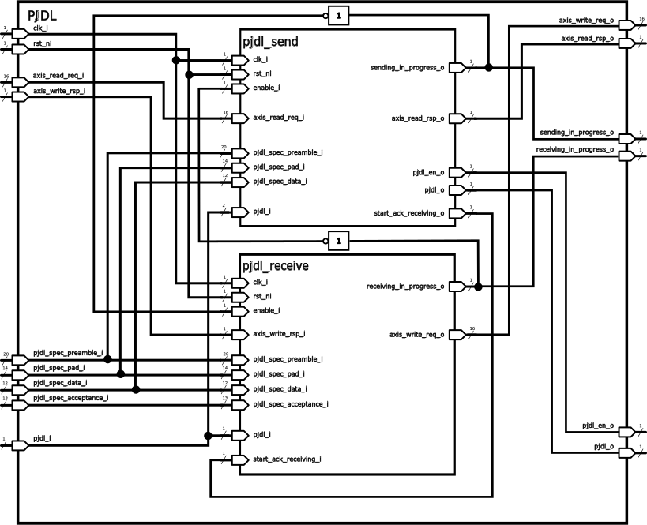

# PJDL Hardware Module

This is a hardware implementation of the [PJDL](https://github.com/gioblu/PJON/blob/master/src/strategies/SoftwareBitBang/specification/PJDL-specification-v5.0.md) data link.  PJDL is a single-wire data link protocol and belongs to the [PJON](https://github.com/gioblu/PJON) network protocol.
This hardware module was writen as part of my bachelors project at [ETH](https://ethz.ch/de.html).

## Why
The PJON protocol including the PJDL data link in the [main repository](https://github.com/gioblu/PJON) is written in C++. This is great as it is very flexible and allows the protocol to run on a wide range of different devices. It however brings the disadvantage, that the micro controllers have to poll often on the bus, to not miss anything coming in. They also need a lot of time sending and receiving data.
The hardware module in this repository can be used in a processor architecture to take the PJDL sending and receiving tasks from the processor, and do these tasks in the hardware directly. The module can also be used in FPGA logic implementations which need the PJDL-protocol or even hardware sensor which should be connected to PJDL.

## Architecture
The PJDL module is divided into two sub modules. One for sending and one for receiving.
The complete module can be seen in figure 5.2. The two sub-modules are interconnected
in a way, that they disable each other if the are running. This is to prevent sending
when the bus is already busy, as well as to prevent receiving its own data. Apart from
this interconnection, there is also the "start_ack_receiving"-connection, which lets the
receving module know, when it should start receiving an acknowledgment. This then
activates the receiving module even if the enable pin is still low and the receiving module
starts receiving the acknowledgment.
All the other signals are routed directly out from the PJDL module and are described in
the next subsection.

### Module-Interfaces
The following inputs and outputs are present on the PJDL module:
* `clk_i`, `rst_ni`: basic timing and reset signals from the parent modules
* `axis_read_req_i`, `axis_read_rsp_o`: axi-stream interface, data sent to this interface will 
be sent out over PJDL -> AXI stream protocol is explained in more
detailed later on in this section
* `axis_write_rsp_i`, `axis_write_req_o`: axi-stream interface, data received over
PJDL is sent out over this interface -> AXI stream protocol is explained in more
detailed later
* `pjdl_spec_preamble_i`, `pjdl_spec_pad_i`, `pjdl_spec_data_i`, `pjdl_spec_acceptance_i`:
Timing specifications for the PJDL protocol. These signals are meant as settings
and shouldn’t be changed often. The settings should be set according to the PJDL
specification in table 2.1. Small deviations from the specified values can help to
mitigate delays coming from the I/O-logic.
* `sending_in_progress_o`, `receiving_in_progress_o`: signals allowing a parent
signal to read out the current state of the PJDL module. Signals are high if the
modules are currently sending or receiving data
* `pjon_i`, `pjon_o`, `pjon_en_o`: The actual PJDL interface -> individual pins described in more detail later

#### AXI-stream interface
AXI-Stream interfaces where chosen for their simplicity and to have a clear standard to
follow. The AXI-Stream interfaces where designed according to the [AMBA AXI-Stream
specification by arm](https://developer.arm.com/documentation/ihi0051/a). This document only describes how AXI-stream was used for
this project:

For our AXI-Stream interface we use 8 data bits on `TDATA` to transfer one byte at a time.
The `TLAST` signal of the AXI-stream bus is used in our case, to signal the end of a PJDL-frame. 
TSTRB isn’t used as we do not need any position bytes. All bytes received over
the AXI stream interface are currently interpreted as data bytes.

`TID`, `TDEST` and `TWAKEUP` aren’t used either and their values are ignored.

The `TKEEP` value isn’t used by the PJDL-receiver. The sender in contrast ignores packets
if the `TKEEP` is kept low. If `TKEEP` is low while `TLAST` is high, the end of the frame is still
recognized.

The `TUSER` signal is not used by the PJDL-receiver. The PJDL-sender on the other hand
uses two bits of user signals for additional information:\
Bit 0 indicates the sending module that the corresponding byte is an acknowledgment.
This is important for the sending module, as the data is then synced to the busy signal on
the PJDL input and sent without a frame initialization. `TLAST` should always be active
as well if this bit is set, as the acknowledgment is always the last bit of its transfer.\
Bit 1 indicates an acknowledgment request. If this bit is set, the PJDL-sender starts
creating a signal to keep the bus busy until it sees a change on the PJDL-input. As soon
as this is the case, it indicates the receiving module to start receiving which will then
start receiving the acknowledgment coming from the other side. `TLAST` should also be
high if bit 1 is set.
Bit 0 and 1 should never be set at the same time.

The AXI-stream interface allows to signal in both direction, whether data is ready to be
sent and valid to receive. It is important to remember though, that the PJDL interface
can’t stall its transmission. For a certain time, the data can be buffered in the PJDL-modules 
internal buffer (see parameters further down). As soon as the receiving buffer
is full, all new data arriving on the PJDL bus is ignored and the PJON layer 3 communication will be corrupted.\
The same goes for the sending buffer. If it is completely empty, the PJDL module sends
bytes with zero values, which will corrupt the layer 3 transfer as well.

#### PJDL interface
The PJDL bus is mostly used with a single wire. To keep as many options open as possible, it was still implemented with two separate lines for this module. With an additional
output enable, the module indicates whether it is currently outputting something or only
listening. That way, PJDL can be used on two separate lines or combined together to a
single line with some simple logic. If all signals are actually routed to the outside of a
chip, this allows even for more advanced sending and receiving circuits with additional
amplifiers, filters and different voltages.

### Module Parameters
The PJDL module has three module parameters that can be set. In the following, each of these parameters is explained.

#### BufferSize
The PJDL module features one buffer in each direction on the AXI-stream interfaces. This allows to buffer data that was received or is ready to be sent. The buffer size can be configured with the "BufferSize" parameter. The default value is set to two and it can be lowered to a minimum of one.

#### AXI Stream types
The `axis_req_t` and `axis_rsp_t` type parameters are the inputs for the AXI-stream types. They define the with of all the signals that are part of the axi-stream interface. Of course all the different sizes have to be set in the correct way as described above, to work properly. Still having these types as parameters makes it easier as the typedefs only have to be done once. To define them in the correct way, the following code segment can be used:

## Processor integration
As part of this project, the PJDL module was also integrated into the [Croc-SoC](https://github.com/pulp-platform/croc), together with a Direct Memory Access Module (DMA). All the necessary libraries to work with PJON where developed as well. \
The whole integration including the software are planned to be published at a later date.

## Bender
This project works with the dependency manager [Bender](https://github.com/pulp-platform/bender). To make it as easy as possible to reuse this module, the submodules are included in this repository as well. They can be found in the .bender folder. To update them, Bender is required.

## License
Unless specified otherwise in the respective file headers, all code checked into this repository is made available under a permissive license. All hardware sources and tool scripts are licensed under the Solderpad Hardware License 0.51 (see `LICENSE.md`). All software sources are licensed under Apache 2.0.\
The files in .bender are from submodules and could have their own licence specified in their respective folders and repositories.